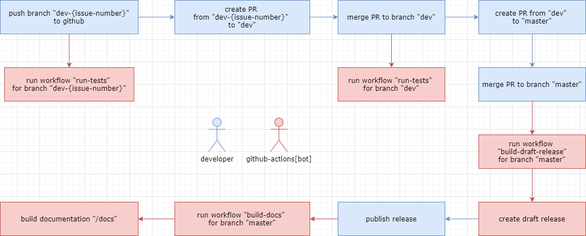

# UnitedGameJam2020

## Процесс разработки

## CI workflows

- `build-draft-release` - генерирует draft-релиз, после `push` в ветку `master`
- `build-docs` - генерирует документацию для GitHub Pages, запускается после публикования релиза
- `run-tests` - запускает тесты, после `push` в любой ветке
- `unity-license-request` - генерирует файл активации Unity, запускается вручную

## Ветки

- `master` - ветка последнего релиза
- `dev` - ветка последних разработок
- `dev-{issue-number}` - ветка для issue, с номером `{issue-number}`

## Правила коммита

- Формат - `git commit -m "{keyword} #{issue-number}. {commit-message}"`
- `keyword` - ключевое слово
    - Closes или closes - если issue выполнено
- `issue-number` - номер issue
- `commit-message` - сообщение коммита

## Лицензии

- Лицензия проекта: [LICENSE](./LICENSE)
- Лицензия Unity
    - [Licenses/Unity_v2019.3.11f1.alf](./Licenses/Unity_v2019.3.11f1.alf) - Файл активации Unity
    - [Licenses/Unity_v2019.x.ulf](./Licenses/Unity_v2019.x.ulf) - Free-лицензия Unity
    - Документация по выпуску лицензии: https://game.ci/docs/github/activation

